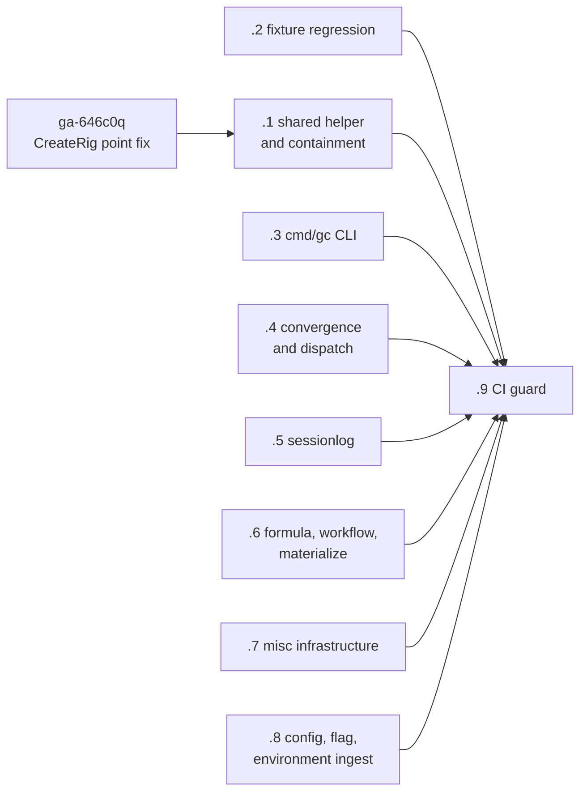

# Plan — canonical paths at ingest

**Bead:** `ga-iawy13`  
**Architecture ruling:** `ga-4bqjjn`  
**Related point fixes:** `ga-646c0q`, `ga-xbilek`  
**Prepared:** 2026-07-29  
**Status:** decomposed into nine independently landable work packages

## Problem

Gas City currently mixes raw paths, paths normalized by
`pathutil.NormalizePathForCompare`, and paths resolved directly through
`filepath.EvalSymlinks`. A comparison can therefore change result when a city,
rig, transcript root, or source directory is reached through a symlink.

The architecture ruling chooses one invariant:

> Normalize a filesystem path exactly once when it enters the domain. Store and
> pass the canonical value thereafter. Comparison sites use plain equality or
> `filepath.Rel`; they do not normalize again.

This completes the direction already used by city discovery and store-scope
resolution. It does not restore raw-as-configured paths.

## Delivery strategy

The work is split by ownership boundary so each change can be reviewed,
tested, landed, or reverted without coupling unrelated packages:

| Bead | Package | Route | Immediate state |
| --- | --- | --- | --- |
| `ga-iawy13.1` | Shared nearest-existing-path helper and rig containment integration | `ready-to-build` → `gascity/builder` | Blocked by the in-flight `ga-646c0q` point fix |
| `ga-iawy13.2` | Canonical fixture assertions and an explicit symlinked discovery regression | `needs-tests` → `gascity/validator` | Ready |
| `ga-iawy13.3` | `cmd/gc` CLI call-site classification and migration | `ready-to-build` → `gascity/builder` | Ready |
| `ga-iawy13.4` | `internal/convergence` and `internal/dispatch` | `ready-to-build` → `gascity/builder` | Ready |
| `ga-iawy13.5` | `internal/sessionlog` readers | `ready-to-build` → `gascity/builder` | Ready |
| `ga-iawy13.6` | Formula, source-workflow, and skill materialization paths | `ready-to-build` → `gascity/builder` | Ready |
| `ga-iawy13.7` | Remaining infrastructure packages | `ready-to-build` → `gascity/builder` | Ready |
| `ga-iawy13.8` | `city.toml`, CLI flag, and environment path ingest | `ready-to-build` → `gascity/builder` | Ready |
| `ga-iawy13.9` | Repository guard against new unclassified bare `EvalSymlinks` calls | `ready-to-build` → `gascity/builder` | Blocked by packages 1–8 |

Each bead contains its measurable acceptance criteria and focused validation
commands. The subsystem packages are intentionally parallel; no artificial
dependency serializes them.

## Classification contract

Packages `ga-iawy13.3` through `ga-iawy13.7` must classify every scoped
production `filepath.EvalSymlinks` call:

| Class | Required disposition |
| --- | --- |
| Comparison preparation | Move normalization to the owning ingest boundary through `internal/pathutil`; use the canonical value downstream without re-normalizing comparisons |
| Existence or resolvability check | Keep the direct call only when its behavior depends on `EvalSymlinks` success or failure, and add the standard adjacent justification marker accepted by the final guard |

Every package records a per-site matrix in its pull request or bead notes with
the file, classification, and final disposition. This makes review a behavioral
audit rather than a mechanical replacement.

## Sequencing

1. Land the fixture regression and the five subsystem sweeps in parallel.
2. Land configuration, flag, and environment normalization independently; it
   owns boundary design rather than the mechanical call-site sweep.
3. Let `ga-646c0q` finish. Then land `ga-iawy13.1` on top of its actual result,
   sharing the missing-path ancestor walk without duplicating or reverting the
   point fix.
4. Land `ga-iawy13.9` after all eight packages. Its baseline should contain
   only the canonical implementation in `internal/pathutil` and explicitly
   justified existence checks.

Only unblocked children should be slung immediately. The core helper and final
guard receive context by mail and become routable when their dependencies
close.

## Program acceptance

The parent ruling is implemented when all nine children are closed and:

- city and rig discovery, configuration, flags, and environment variables
  place canonical paths into domain state;
- real and symlinked spellings produce identical identity and containment
  decisions on every supported platform;
- security-sensitive containment still rejects genuine escapes and retains
  its symlink-aware defense-in-depth pass;
- every scoped production `EvalSymlinks` call is migrated or explicitly
  justified as an existence check;
- an explicit symlinked fixture test detects any regression to returning raw
  discovery paths;
- CI rejects future unclassified bare calls outside `internal/pathutil`;
- non-symlinked behavior and all existing CLI/config contracts remain
  unchanged; and
- the relevant focused tests, `make test-fast-parallel`, applicable sharded
  process/integration targets from `TESTING.md`, and `go vet ./...` pass.

## Risks and controls

| Risk | Control |
| --- | --- |
| A fixture that canonicalizes both sides can pass without exercising a symlink | `ga-iawy13.2` requires an explicit symlink target and must fail if discovery returns the raw link |
| A broad sweep hides a wrong per-site judgment | Each subsystem lands separately and publishes its classification matrix |
| The core package duplicates the active CreateRig fix | `ga-iawy13.1` is blocked on `ga-646c0q` and must integrate its final diff |
| A missing target cannot be resolved with plain `EvalSymlinks` | The shared helper preserves the nearest-existing-ancestor behavior and receives edge-case tests |
| A new contributor reintroduces the split invariant | `ga-iawy13.9` adds a deterministic repository guard after the sweep |
| The work is misreported as a current macOS regression | Beads preserve the evidence boundary: this is a cross-platform symlinked-city defect; the cited post-`#4695` macOS run showed only reaper failures |

## Out of scope

- `ga-xbilek`: the reaper `isStrictlyUnderDir` point fix.
- `ga-646c0q`: the active CreateRig point fix, except for integrating its landed
  result into the shared-helper package.
- Mac Regression `needs-mac` label gating.
- A `city.toml` schema change, new CLI flag, new environment variable, or new
  third-party path library.
- Reintroducing normalization at every comparison site.

## Planning-system note

The current repository decision in `ga-f74ph9` places internal PM artifacts in
`engdocs/plans`, not the public Mintlify `docs/` tree. The active pack prompt
still names `docs/plans`; existing open bead `ga-f74ph9.1` owns that pack-level
correction. This artifact follows the repository decision and is committed
from `engdocs/plans`.
